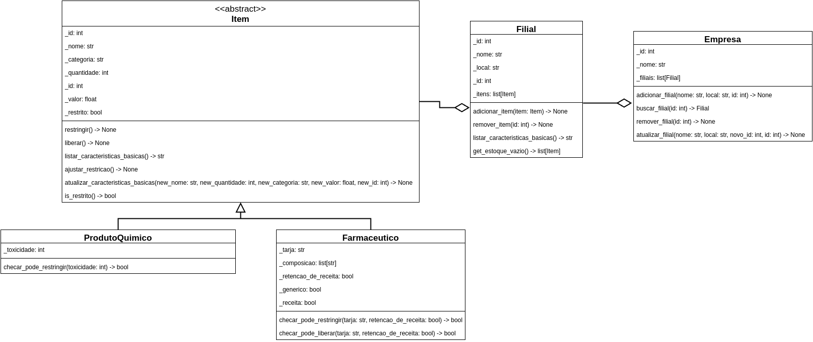

<p id="header" align="center">
  
</p>

<p id="main-icon" align="center">
    
</p>

<!-- <p align="center">
    Powered by:
</p>
<p id="languages" align="center">
    
</p>

<p id="ides" align="center">
    
    
</p>
<p id="ides" align="center">
    
    
    
</p> -->

# Gerenciador de Estoque TPPE - 25.1

Esse projeto é uma aplicação de gerenciar estoques de uma empresa por meio de uma interface gráfica. Onde uma empresa
pode ter zero ou mais filiais, com um estoque cada.

| Aluno                             | Matrícula |
| --------------------------------- | --------- |
| Eduardo Matheus dos Santos Sandes | 221008024 |

## Tabela de conteúdos

- [Screenshots](#screenshots)
- [Diagramas](#diagramas)
<!-- - [Uso](#uso)
- [Tecnologias](#tecnologias) -->
- [Status](#status)
- [Grupo original OO - 23.1](#grupo-original-oo---231)
- [Repositório antigo](https://github.com/Hunter104/T5.5-M_Gerenciamento_Estoque)


## Links para documentos
- [Diagrama UML](/docs/diagramas/diagrama-classes-modelo.png)
- [Backlog do projeto](/docs/backlog.md)
- [Diagrama físico](/docs/diagramas/diagram_fisico_banco.png)

## Screenshots


## Diagramas

### Diagrama de classes:



### Diagrama físico:


<!-- ## Uso

Para iniciar a interface gráfica apenas é necessário rodar o ponto de entrada main na classe
```ViewMain``` do pacote view, dentro da pasta ```src``` do projeto, para inserir dados pré-existentes ao iniciar
utiliza-se a opção de linha de comando ```--dados-aleatorios```

## Tecnologias

Foi utilizada a linguagem de programação ```java``` em conjunção a framework ```JUnit``` para testes
e o Look and Feel customizado flatlaf para swing -->

## Status

O projeto aguarda apenas detalhes de implementação e documentação para a próxima release

## Grupo Original OO

Somos do grupo número 5, do tema 5: "Gerenciamento de estoque", da turma T03(Manhã)
na disciplina de Orientação a Objetos regida pela prof. Fabiana Freitas Mendes
<br>
O código do nosso grupo é: T5.5-M

### integrantes

| Aluno           | Perfil        | Matrícula |
|:----------------|:--------------|:---------:|
| André Emanuel   | Hunter104     | 221007813 |
| Eduardo Matheus | DiceRunner714 | 221008024 |
| Cássio Sousa    | csreis72      | 221021886 |

<p id="footer" align="center">
  
</p>
